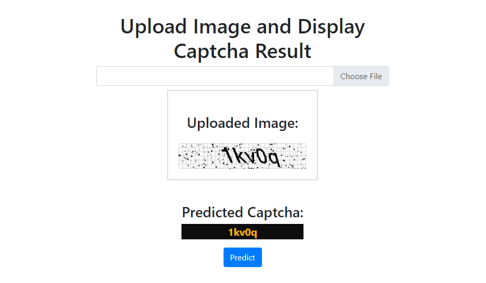

<h1 style="text-align: center">Image Captcha Solver</h1>


<p style="text-align: center">


</p>

## Overview

**Image Captcha Solver** is a deep learning–powered application built with **PyTorch** and served via a **Django-based user interface**. It is capable of accurately reading and decoding text from captcha images containing lowercase letters and digits.

The solution consists of two components:
- A **CNN-RNN model** trained to decode captcha text.
- A **Django web interface** for uploading captcha images and visualizing predictions.

---

## Features

- Accurate recognition of captcha images using a CNN + GRU architecture.
- User-friendly interface built with Django to upload and solve captchas.
- Integration-ready model class for backend/CLI prediction.
- Trained on a synthetic captcha dataset with augmentation support.

---

## Interface Preview



---

## Project Structure

```
    captcha_solver/
    │
    ├── core/ # Django app with views, models, urls
    ├── static/ # Static assets (CSS, JS, etc.)
    ├── templates/ # Django HTML templates
    ├── trained_model/
    │ └── model.pth # Trained PyTorch model
    ├── utils/ # Model class and prediction helpers
    ├── manage.py
    ├── requirements.txt
    ├── Predict.ipynb # Colab notebook to test predictions
    └── README.md
```

Install Requirements
```
pip install -r requirements.txt
```

Run the Django Server

```python manage.py runserver```

Then, open your browser and go to:
http://localhost:8000/

Upload a captcha image and click Predict to see the result.

## Using the Prediction Notebook (Google Colab) 

To test predictions outside of the UI:

1. Place your trained model (```captcha_model.pth```) in the root directory.

2. Open and run ```Predict.ipynb``` in Google Colab.

3. Use the ```captcha-solver``` class and its ```predict_captcha_from_image()``` method for inference on any image.

## Model Architecture
The model is composed of a Convolutional Neural Network (CNN) followed by a Bidirectional GRU:

## Model Architecture

The model architecture consists of a Convolutional Neural Network (CNN) for feature extraction followed by a Recurrent Neural Network (RNN) for sequence modeling and text prediction using CTC decoding.

### CNN Layers
- `Conv2D(3 → 256), kernel_size=3, padding=1`
- `MaxPool2D(kernel_size=2)`
- `Conv2D(256 → 128), kernel_size=3, padding=1`
- `MaxPool2D(kernel_size=2)`
- `Conv2D(128 → 64), kernel_size=3, padding=1`
- `MaxPool2D(kernel_size=2)`

### RNN Layers
- `Linear(576 → 128)`
- `Dropout(p=0.2)`
- `GRU(128 → 64), bidirectional=True, num_layers=2, dropout=0.25`
- `Linear(128 → 64)`
- `Linear(64 → num_classes + 1)` (for CTC decoding)

---

## Dataset

The model was trained on a custom captcha dataset consisting of images with a mix of lowercase letters and digits. Data augmentation was applied using the **Albumentations** library to improve generalization and robustness.

---

## Contribution

Contributions are welcome. You can:
- Open an issue for bug reports or feature suggestions.
- Submit a pull request to add enhancements.
- Follow the existing coding style and structure.

---

## License

This project is licensed under the **MIT License**.  


