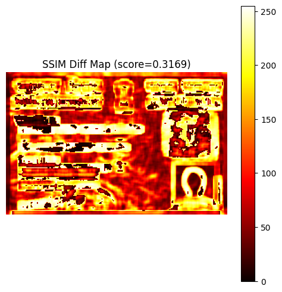
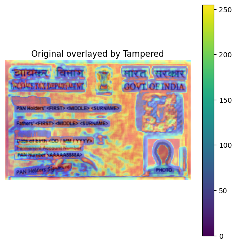
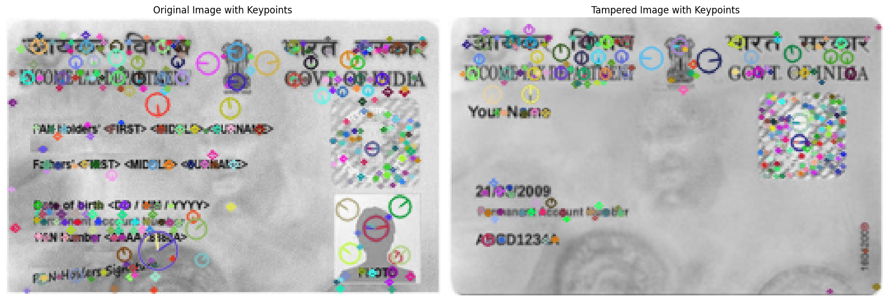
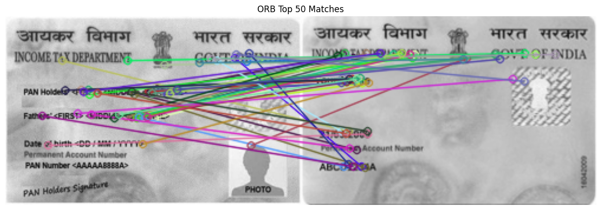

# 🛡️ PAN Card Image Tampering Detection

This project explores multiple image processing techniques to detect tampering in **PAN card images**. While most solutions only use **SSIM (Structural Similarity Index)**, this project dives deeper — using several complementary approaches to improve detection accuracy and visual interpretability.

## 🔍 What This Project Does

Given an original PAN card image and a potentially tampered version, the notebook analyzes both using:

- **Image Subtraction** – Highlights exact pixel-level changes
- **PSNR (Peak Signal-to-Noise Ratio)** – Quantifies image degradation
- **SSIM (Structural Similarity Index)** – Measures structural similarity
- **Feature-Based Matching**:
  - SIFT (Scale-Invariant Feature Transform)
  - SURF (Speeded-Up Robust Features)
  - ORB (Oriented FAST and Rotated BRIEF)

Each technique is visualized and explained, so the analysis isn’t just technical — it’s also understandable.

> ✅ Useful for document fraud detection, digital forensics, and academic learning.

---

## 🗂️ Folder Structure
```
pan-card-image-tampering-analysis/
│
├── images/
│ ├── original.png # Original (authentic) PAN card image
│ └── tampered.png # Tampered version to test detection
|
├── results/                 # result images
│
├── pan-card-image-tampering-analysis.ipynb # Main analysis notebook
└── README.md
```

---

## ❓ How to Use

1. Clone the repo or download the notebook.
2. Place your own `original.png` and `tampered.png` inside the `images/` folder.
3. Run the notebook: `pan-card-image-tampering-analysis.ipynb`.
4. Observe the resultss of each method and compare visual + numerical results.

All dependencies are standard OpenCV + Python libraries.

---

## 🔍 Results

Below are sample visual results from the notebook using different image tampering detection techniques.

### 1. SSIM Analysis

Side-by-side resultss showing structural difference and tampered area overlay.

<p align="center">
  
  
</p>

---

### 2. Image Subtraction

This highlights exact pixel-level changes between the original and tampered images.

<p align="center">
  
</p>

---

### 3. Keypoint Matching (SIFT)

SIFT detects and matches keypoints that reveal structural inconsistencies introduced by tampering.

<p align="center">
  
</p>

---

### 4. ORB Feature Similarity

ORB matching visualizes correspondence between the two images using fast binary descriptors.

<p align="center">
  
</p>


## 📌 Why This Matters

Most tutorials stop at SSIM. But real-world forgery can bypass simple similarity checks. By combining statistical, structural, and feature-based methods, we can detect more subtle and localized tampering.

This project shows how — without needing deep learning or big datasets.

---

## 💡 Possible Improvements

- Add automatic forgery scoring based on combined metrics
- Integrate into a Flask or FastAPI backend
- Test with real-world tampered datasets

---

## 🗒️ NOTE: 

This was built to push beyond course-level solutions. If you’ve seen SSIM-only demos — this takes it several steps further. It’s a great starting point if you're exploring **image forensics**, **document validation**, or just want to understand how visual similarity can be quantified and interpreted.

---

## 📬 Contact

If you're working on something similar, have questions, or want to collaborate, feel free to reach out!

- 📧 Email: arooshahmad.data@gmail.com
- 💼 LinkedIn: [Aroosh Ahmad](https://www.linkedin.com/in/arushahmd)


